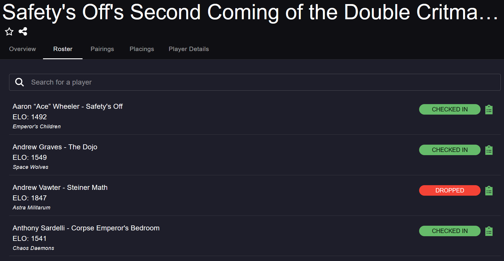
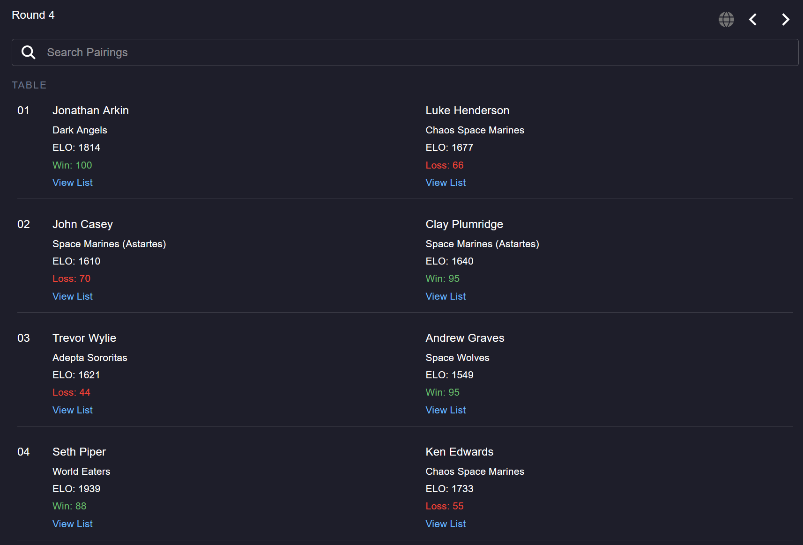
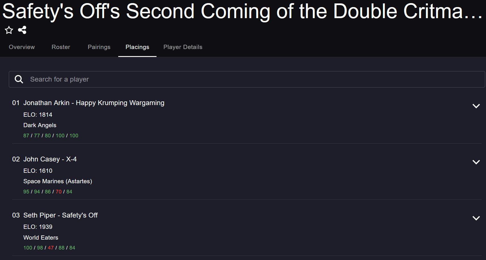
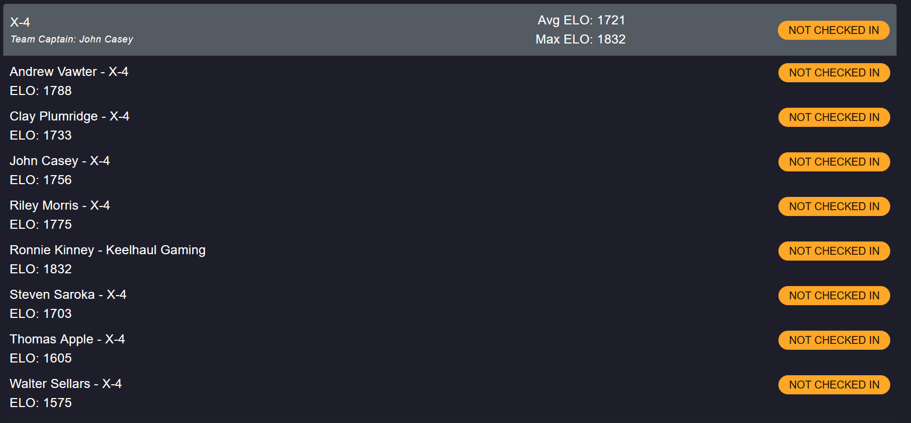

# 40k Elo Extension for Best Coast Pairings

This project creates a FireFox / Chrome Extension that annotates various screens in Best Coast Pairings events with the Elo of players displayed. It works on the Roster, Pairings, and Placings screens. The psychic damage you receive by knowing your opponent's Elo is not yet well understood; this extension is not recommended for the easily tilted or those easily intimidated.

There is also limited specialized support for Team Events; on the **Roster tab only**, the Extension displays the average and max Elo for each team.

## FAQ

### Where do these Elo ratings come from?

This project uses [Stat Check's Global Elo Leaderboard](https://www.stat-check.com/elo); you can find a copy of the sheet in the project at at [data/elo.xlsx](data/elo.xlsx). I can't download it programatically because Microsoft hates making APIs available, so it requires a manual update every time. You can expect updates to come out within a day or so of the actual dashboard unless I'm busy, in which case it'll happen whenever I notice. The JSON version of the Elo sheet is hosted [here](https://clayplumridge.github.io/40k-elo-extension/elo.json) for the Extension to actually fetch.

### Can I use the JSON data for some other project?

I can't actually stop you without breaking the extension, but I ask that you clear any usages with Stat Check before making them publicly available. It's their project, and I will yank it down if they ask me to. Don't be the guy that ruins it for everyone.
